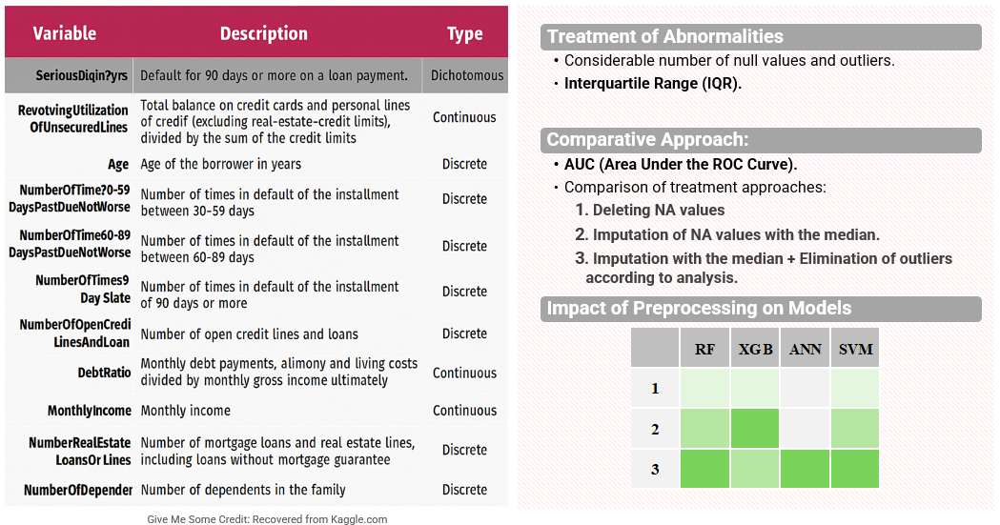
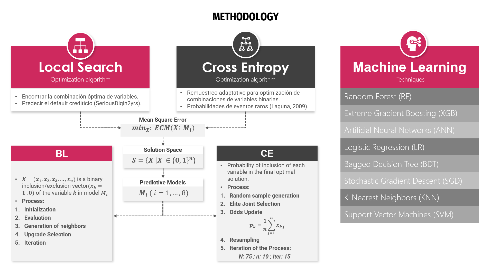
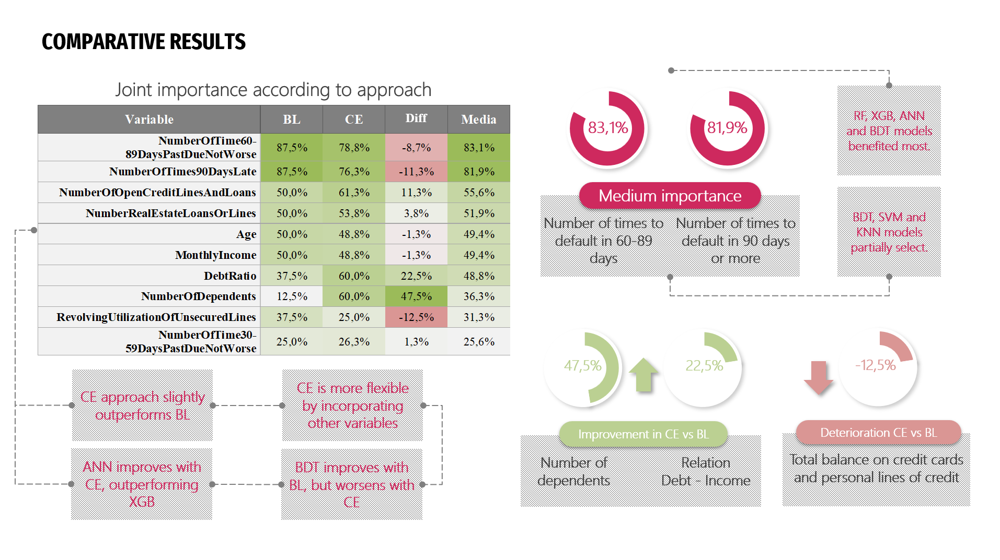

# Machine Learning Applied to Credit Risk Analysis

*Can optimization algorithms improve credit risk modeling with Machine Learning and Deep Learning? In this project, I combine both to achieve more accurate, scalable predictions—approaches increasingly adopted by FinTech and BigTech to stay ahead in data-driven financial innovation.*

This project aims to analyze the applicability of Machine Learning techniques in credit risk analysis, with a particular focus on the selection of relevant variables and the optimization of predictive models. The literature review highlights that these techniques outperform traditional methods in risk prediction and loss reduction. Additionally, there is a growing interest in the applicability of unconventional approaches based on Deep Learning methods, which, together with non-financial alternative data, promote financial inclusion. As methodology, two optimization algorithms are proposed: Local Search (BL) and Cross Entropy (CE), combined with various Machine Learning techniques to enhance the process of identifying optimal combinations of variables, focusing on the most influential ones in credit risk prediction. The results show that data preprocessing, including value imputation and outlier removal, is crucial to improving model accuracy. The comparative analysis between BL and CE suggests that both methods improve model performance, although CE offers greater flexibility in selecting additional variables, leading to further optimization improvements. Moreover, it was found that longer loan payment delays are key predictors in credit risk analysis.

---

## Repository Structure

The initial step considers the exploration and analysis of the original database, processing both for training and testing, a modified version that considers the treatment of null values ​​and outliers, which improves the quality of data within the model.

| File/Folder                                      | Description                                                                                  |
|--------------------------------------------------|----------------------------------------------------------------------------------------------|
| `Exploratory-Data-Analysis.ipynb`                | Jupyter notebook for initial data exploration, cleaning, and visualization.                  |
| `CE models.py`                                   | Python script for feature selection using various ML models optimized with Cross Entropy.     |
| `BL models.py`                                   | Python script for feature selection using various ML models optimized with Local Search.      |
| `Research/`                                      | Folder containing the full research report (Machine_Learning_Applied_to_Credit_Risk_Analysis.pdf) and presentation to his defense (Thesis_Presentation.pptx).   |
| `Data/`                                          | Folder containing original and processed datasets of Give Me Some Credit                         |  
| `README.md`                                      | This project description and instructions.                                                   |
| `LICENSE`                                        | License for the code in this repository.                                                     |

---

## 📊 Data

The dataset used is the renowned "Give Me Some Credit" dataset from Kaggle, with over 250,000 anonymized consumer loan records, split into 150,000 labeled training samples and 101,503 unlabeled test samples. This dataset is widely referenced in academic research due to its applicability in benchmarking various Machine Learning (ML) and Deep Learning (DL) models for credit scoring.

| Variable                                   | Description                                                                                                                      | Type                |
|---------------------------------------------|----------------------------------------------------------------------------------------------------------------------------------|---------------------|
| SeriousDlqin2yrs                           | Borrower is delinquent or overdue by 90 days or more on a payment.                                                               | Quantitative, Binary (Tarjet)|
| RevolvingUtilizationOfUnsecuredLines        | Total balance on credit cards and personal lines of credit (excluding real estate and installment debt) divided by credit limits. | Quantitative, Continuous |
| Age                                        | Age of the borrower in years.                                                                                                    | Quantitative, Discrete   |
| NumberOfTime30-59DaysPastDueNotWorse       | Number of times borrower has been 30-59 days past due but no worse in the last 2 years.                                          | Quantitative, Discrete   |
| DebtRatio                                  | Monthly debt payments, alimony, and living costs divided by gross monthly income.                                                | Quantitative, Continuous |
| MonthlyIncome                              | Borrower's monthly income.                                                                                                       | Quantitative, Continuous |
| NumberOfOpenCreditLinesAndLoans            | Number of open installment loans (e.g., car loans, mortgages) and lines of credit (e.g., credit cards).                         | Quantitative, Discrete   |
| NumberOfTimes90DaysLate                    | Number of times borrower has been 90 days or more past due.                                                                      | Quantitative, Discrete   |
| NumberRealEstateLoansOrLines               | Number of real estate loans or lines, including home equity lines of credit.                                                     | Quantitative, Discrete   |
| NumberOfTime60-89DaysPastDueNotWorse       | Number of times borrower has been 60-89 days past due but no worse in the last 2 years.                                          | Quantitative, Discrete   |
| NumberOfDependents                         | Number of dependents in the family, excluding the borrower (e.g., spouse, children, etc.).                                      | Quantitative, Discrete   |

*Source: Own elaboration based on the “Give Me Some Credit” dataset.*

### Key Characteristics

- **Imbalance**: Only **6.7%** of cases in the training data correspond to defaults.
- **Extreme values**: Features like `DebtRatio`, `MonthlyIncome`, and `RevolvingUtilizationOfUnsecuredLines` show **high variability**.
- **Missing values**: Found particularly in `MonthlyIncome` and `NumberOfDependents`.
- **Correlations**:
  - Strong positive correlation between the target and delay features (`30-59`, `60-89`, `90+` days).
  - Negative correlation between age and number of dependents.

### Data Cleaning & Transformation

To improve prediction quality:

- **Imputation** with mean/median.
- **Outlier detection** via IQR method.
- **Best model performance** occurred when applying:
  - Median imputation + Outlier removal.

This preprocessing significantly improved model robustness and stability, especially for models like Random Forest and XGBoost, which achieved AUC scores above 0.85.

---

## 🧠 Methodology

A hybrid strategy combining feature selection optimization and supervised ML & DL models was implemented.

### Optimization Algorithms

1. **Local Search (BL)**:

    - Iteratively explores the neighborhood of current feature sets.
    - Minimizes model Mean Squared Error (MSE).
    - Simple and efficient for smaller subsets.

2. **Cross Entropy (CE)**:

    - Uses a probabilistic model to evolve feature selections.
    - Prioritizes combinations with lower prediction error.
    - Provides greater exploration and flexibility in feature space.

---

## 📈 Results

### Local Search (BL)

- On average, the BL optimization reduced the **MSE by 0.253%**.
- **Bagged Decision Trees (BDT)** showed the most significant improvement, with a **0.675% gain**, followed by **XGBoost** and **Random Forest**.
- **Support Vector Machines (SVM)** did not improve with BL, indicating limited adaptability to this method.
- Key predictors such as `NumberOfTimes90DaysLate` and `NumberOfTime60-89DaysPastDueNotWorse` were selected in **87.5% of the models**, confirming their strong association with default risk.

### Cross Entropy (CE)

- CE achieved a slightly higher average improvement of **0.266%** in MSE.
- The **SGD classifier** benefited the most, improving by **0.475%**, followed by **XGBoost** and **BDT** with **0.400%** gains.
- **Artificial Neural Networks (ANN)** surpassed XGBoost in performance when `DebtRatio` was included in the optimal subset — a scenario not observed with BL.
- **SVM** again showed no performance enhancement.
- Variables such as `DebtRatio` and `NumberOfDependents` gained more prominence in CE, appearing in **60%** of the best models, compared to just **37.5%** and **12.5%** in BL, respectively.

### Overall Insights

- While both optimization algorithms enhance model performance, **CE slightly outperforms BL**, especially in capturing complex interactions among variables.
- BL tends to focus on highly obvious predictors (e.g., severe payment delays), whereas CE explores broader feature interactions, yielding improved generalization.
- **Top-performing models across both methods** were Random Forest, XGBoost, BDT, and ANN.
- The highest AUC achieved was **0.8589** using **Random Forest with CE**, following robust preprocessing (median imputation + outlier removal).

---

For more details, see the research paper related.

---

## Research Paper and Presentation

The folder `Research/` contains:
- `Machine_Learning_Applied_to_Credit_Risk_Analysis.pdf`: The full research report, which includes precedent tracking, methodologies implemented, results, and conclusions from the implementation of optimized models.
- `Thesis_Presentation.pptx`: The slides used for the defense and final presentation of the research project to the academic authorities.

**License:**  
These documents are © David Felipe Vargas Cadena, 2025.  
They are licensed under a [CC BY-NC-ND 4.0](https://creativecommons.org/licenses/by-nc-nd/4.0/) license.  
You may share these documents with attribution, but you may not use them commercially or create derivative works.

---

## Contact

For questions or collaboration, please contact:  
**David Felipe Vargas Cadena**  
https://www.linkedin.com/in/davidfvargasc/  |  https://github.com/eldeivin/

---